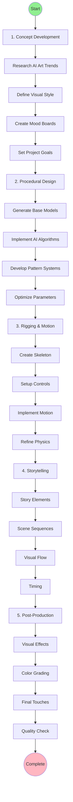

# ASSETS

```mermaid
flowchart TD
    Start((Start)) --> Concept
    
    Concept[1. Concept Development] --> A1
    A1[Research AI Art Trends] --> A2[Define Visual Style]
    A2 --> A3[Create Mood Boards]
    A3 --> A4[Set Project Goals]
    
    A4 --> Procedural[2. Procedural Design]
    Procedural --> B1[Generate Base Models]
    B1 --> B2[Implement AI Algorithms]
    B2 --> B3[Develop Pattern Systems]
    B3 --> B4[Optimize Parameters]
    
    B4 --> Rigging[3. Rigging & Motion]
    Rigging --> C1[Create Skeleton]
    C1 --> C2[Setup Controls]
    C2 --> C3[Implement Motion]
    C3 --> C4[Refine Physics]
    
    C4 --> Narrative[4. Storytelling]
    Narrative --> D1[Story Elements]
    D1 --> D2[Scene Sequences]
    D2 --> D3[Visual Flow]
    D3 --> D4[Timing]
    
    D4 --> PostFX[5. Post-Production]
    PostFX --> E1[Visual Effects]
    E1 --> E2[Color Grading]
    E2 --> E3[Final Touches]
    E3 --> E4[Quality Check]
    
    E4 --> End((Complete))

    style Start fill:#90EE90
    style End fill:#FFB6C1
```
[Back Home](/) |  [DOCS](/docs/) |  [SRC](/src/)

